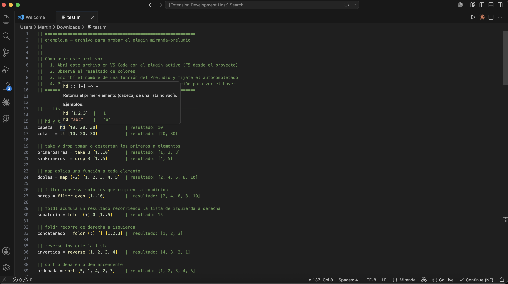
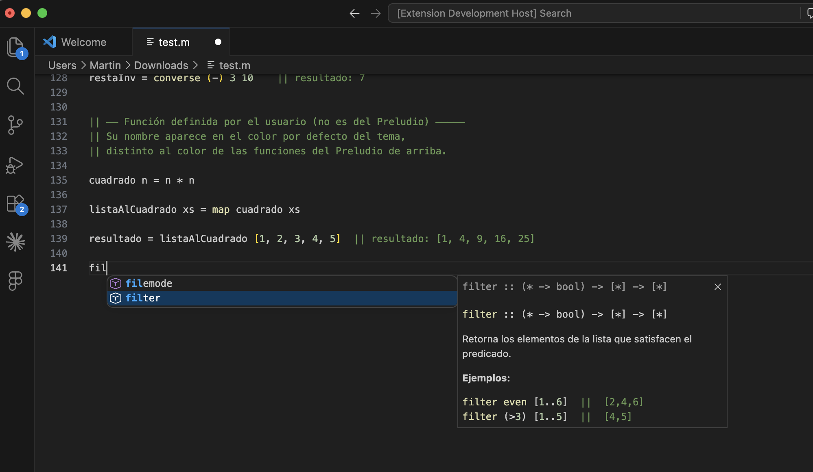

# Miranda Prelude

VS Code extension that improves the experience of writing **Miranda** code, with a focus on the standard Prelude (the language's built-in library).

## Install

[**Install from the VS Code Marketplace**](https://marketplace.visualstudio.com/items?itemName=martinisrael.miranda-preludio)

Or search **Miranda Prelude** in the Extensions view. Complements other Miranda extensions (e.g. Miranda LSP) with bilingual Prelude hover docs, highlighting, and autocompletion.

## Features

### Syntax highlighting

`.m` files are colored automatically. Prelude functions (`map`, `filter`, `sort`, `hd`, `foldl`, etc.) appear in a different color from user-defined code, making it easy to tell standard library calls from your own definitions at a glance.

### Autocompletion

When you start typing a Prelude function name, IntelliSense suggests matches with their type signature. Selecting a suggestion shows full documentation with a description and examples.

### Hover documentation

Hovering over a Prelude function shows a tooltip with:
- The type signature in Miranda notation
- A description of what the function does
- Concrete usage examples with their results

Documentation language follows the VS Code UI language (English by default). You can override it with the `miranda-preludio.documentationLanguage` setting (`auto`, `en`, or `es`).

## Covered functions

The extension documents more than 95 standard Miranda Prelude functions, organized into these categories:

| Category | Examples |
|---|---|
| Lists | `hd`, `tl`, `map`, `filter`, `foldl`, `foldr`, `sort`, `zip2`, `take`, `drop` |
| Arithmetic | `abs`, `sqrt`, `even`, `odd`, `gcd`, `lcm`, `entier`, `sin`, `cos`, `pi` |
| Characters and strings | `code`, `decode`, `digit`, `letter`, `shownum`, `numval`, `lines`, `spaces` |
| Combinators | `id`, `const`, `converse`, `until`, `limit`, `force`, `error` |
| Tuples | `fst`, `snd` |
| System | `read`, `getenv`, `system` |

## Usage

The extension activates automatically when you open any `.m` file.

- **Autocompletion:** start typing a function name — suggestions appear on their own. If not, press `Ctrl+Space` (`Cmd+Space` on Mac).
- **Hover:** place the cursor over any Prelude function and wait a moment.
- **Comments:** the toggle-line-comment shortcut inserts `||` (Miranda's comment syntax).
- **Brackets:** `[`, `(`, and `"` are closed automatically.

## Example files

- [`example.en.m`](example.en.m) — sample Miranda code with English comments
- [`example.es.m`](example.es.m) — same examples with Spanish comments

## Requirements

- Visual Studio Code 1.118.0 or later
- Miranda files with the `.m` extension

## Release notes

### 0.0.1

Initial release. Includes syntax highlighting, autocompletion, and bilingual hover documentation (English and Spanish) for all standard Miranda Prelude functions.

---

# Miranda Prelude

Extensión de VS Code que mejora la experiencia al escribir código en **Miranda**, enfocándose en las funciones del Preludio estándar (la librería incorporada del lenguaje).

## Instalación

[**Instalá desde el VS Code Marketplace**](https://marketplace.visualstudio.com/items?itemName=martinisrael.miranda-preludio)

O buscá **Miranda Prelude** en la vista de Extensiones. Complementa otras extensiones Miranda (p. ej. Miranda LSP) con documentación bilingüe del Preludio, resaltado y autocompletado.

## Funcionalidades

### Resaltado de sintaxis

Los archivos `.m` se colorean automáticamente. Las funciones del Preludio (`map`, `filter`, `sort`, `hd`, `foldl`, etc.) aparecen en un color distinto al del código definido por el usuario, lo que permite distinguir de un vistazo qué pertenece a la librería estándar y qué es propio del programa.

### Autocompletado

Al empezar a escribir el nombre de cualquier función del Preludio, IntelliSense sugiere las coincidencias con su firma de tipo. Al seleccionar una sugerencia, se despliega la documentación completa con descripción y ejemplos.

### Hover con documentación

Al posicionar el cursor sobre una función del Preludio aparece un tooltip con:
- La firma de tipo en notación Miranda
- Una descripción de lo que hace la función
- Ejemplos concretos de uso con su resultado

El idioma de la documentación sigue el idioma de la interfaz de VS Code (inglés por defecto). Podés cambiarlo con el setting `miranda-preludio.documentationLanguage` (`auto`, `en` o `es`).

## Funciones cubiertas

La extensión incluye documentación para más de 95 funciones del Preludio estándar de Miranda, organizadas en las siguientes categorías:

| Categoría | Ejemplos |
|---|---|
| Listas | `hd`, `tl`, `map`, `filter`, `foldl`, `foldr`, `sort`, `zip2`, `take`, `drop` |
| Aritmética | `abs`, `sqrt`, `even`, `odd`, `gcd`, `lcm`, `entier`, `sin`, `cos`, `pi` |
| Caracteres y cadenas | `code`, `decode`, `digit`, `letter`, `shownum`, `numval`, `lines`, `spaces` |
| Combinadores | `id`, `const`, `converse`, `until`, `limit`, `force`, `error` |
| Tuplas | `fst`, `snd` |
| Sistema | `read`, `getenv`, `system` |

## Uso

La extensión se activa automáticamente al abrir cualquier archivo con extensión `.m`.

- **Autocompletado:** empezá a escribir el nombre de una función — las sugerencias aparecen solas. Si no, presioná `Ctrl+Space` (`Cmd+Space` en Mac).
- **Hover:** posicioná el cursor sobre cualquier función del Preludio y esperá un momento.
- **Comentarios:** el atajo de comentar línea inserta `||` (la sintaxis de Miranda).
- **Brackets:** `[`, `(` y `"` se cierran automáticamente.

## Archivos de ejemplo

- [`example.en.m`](example.en.m) — código Miranda de prueba con comentarios en inglés
- [`example.es.m`](example.es.m) — los mismos ejemplos con comentarios en español

## Requisitos

- Visual Studio Code 1.118.0 o superior
- Archivos Miranda con extensión `.m`

## Notas de versión

### 0.0.1

Versión inicial. Incluye resaltado de sintaxis, autocompletado y documentación bilingüe en hover (inglés y español) para todas las funciones del Preludio estándar de Miranda.
